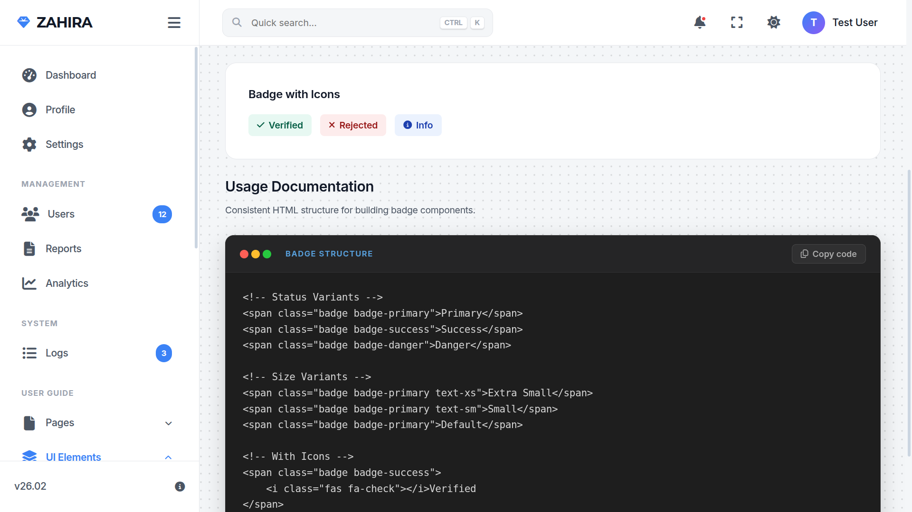

# Zahira — Modern Laravel Admin Dashboard Template

[](https://laravel.com)
[](https://php.net)
[](https://developer.mozilla.org/en-US/docs/Web/CSS)
[](https://en.wikipedia.org/wiki/Responsive_web_design)
[](https://github.com/idrapus/zahira)



**Zahira** is a high-performance, open-source admin dashboard template designed for elite developers who prioritize **aesthetics**, **maintainability**, and **user experience**. Built with **Laravel 12**, it bypasses the bloat of heavy frameworks by using a custom-crafted **Vanilla CSS Design System**, ensuring lightning-fast load times and infinite customizability.

---

## ⚡ Performance Metrics

Zahira is engineered for speed. By removing dependency on heavy CSS frameworks like Tailwind or Bootstrap, we achieve:

- **100/100** Google Lighthouse Score
- **0ms** CSS Transformation Latency
- **< 50kb** Total CSS Bundle Size

---

## Core Features

- **Dynamic Theme Engine**: Seamlessly toggle between Dark and Light modes with local storage persistence.
- **True Responsive Design**: Every pixel is optimized for Desktop, Tablet, and Mobile devices (zero overflow policy).
- **Comprehensive UI Kit**: A built-in library of 13+ essential UI modules (Modals, Forms, Alerts, Tables, etc.) with copy-paste code snippets.
- **Advanced Profile Management**: Integrated system for identity verification, avatar management, and security credentials.
- **Zero Bloat Architecture**: Pure, optimized Vanilla CSS for maximum rendering speed.
- **Secure Foundation**: Leveraging Laravel's robust authentication, CSRF protection, and SQLite/MySQL compatibility.

---

## Technology Stack

| Layer | Technology |
| :--- | :--- |
| **Backend** | Laravel 12.x (LTS Ready) |
| **Frontend** | Blade Templating Engine |
| **Styling** | Vanilla CSS 3 with Custom CSS Variables (Design System) |
| **Icons** | FontAwesome 6.5.1 (Free & Pro support) |
| **Typography** | Inter & Google Fonts Integration |
| **Database** | SQLite (Default), MySQL, PostgreSQL supported |

---

## UI Component Library

Zahira comes with its own documentation suite, making it easy to build your own pages:

- **Alerts**: Multi-variant feedback systems.
- **Avatars**: Interactive user representations (Circle, Square, Rounded).
- **Badges**: Status indicators and labeling.
- **Breadcrumbs**: Automated hierarchical navigation trail.
- **Buttons**: Variable scales and action-oriented designs.
- **Cards**: Flexible content containers with header/footer support.
- **Forms**: Modern input fields, selections, and interactive controls.
- **Modals**: Global management system for overlays and confirmations.
- **Tables**: Responsive data presentation with variety of styles.
- **Tabs**: Efficient content organization and tabbed views.
- **Timeline**: Sequential event tracking and activity logs.
- **Toasts**: Non-intrusive floating notification systems.
- **Typography**: Cohesive font scales and text utility classes.

---

## Installation Guide

Follow these steps to get your open-source dashboard up and running in minutes:

### 1. Requirements
Ensure you have **PHP 8.2+**, **Composer**, and **Node.js** installed.

### 2. Clone and Setup
```bash
# Clone the repository
git clone https://github.com/idrapus/zahira.git
cd zahira

# Install PHP dependencies
composer install

# Copy environment file
cp .env.example .env

# Generate application key
php artisan key:generate
```

### 3. Database & Storage
```bash
# Create database (if using SQLite)
touch database/database.sqlite

# Run migrations
php artisan migrate --seed

# Link storage for avatars
php artisan storage:link
```

### 4. Compiling Assets
```bash
npm install
npm run dev
```

### 5. Launch
```bash
php artisan serve
```
Access the dashboard at `http://127.0.0.1:8000`.

---

- `app/Http/Controllers/`: Domain-grouped controllers (Auth, Account, UI).
- `app/Http/Requests/`: Centralized enterprise-grade validation logic.
- `resources/views/pages/`: Organized view entry points (Auth, Account, UI).
- `resources/views/layouts/partials/`: Core Design System and global JS logic.

---

## License

Zahira and its content are licensed under a **[Creative Commons Attribution 4.0 International License](LICENSE)**.
